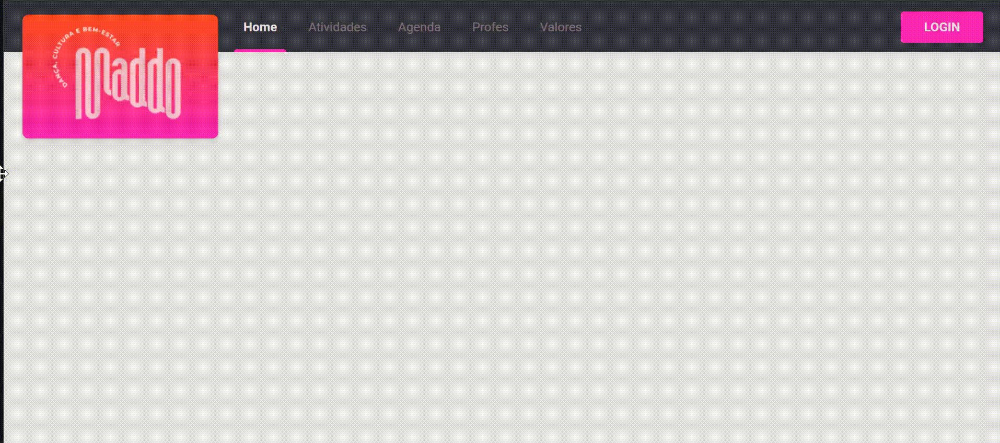

<h1 align="center">Maddo 👋</h1>

<p align="center"><b>Status: Em construção 🚧</b></p>

## 📄 Sobre

## 🔝 Features

Front-end desenvolvido seguindo o proposto no [Figma](https://www.figma.com/file/G15VvAoEhaE20qvtHFPAUg/Maddo?node-id=87%3A0). Autoria: [Bruna Schneiders](https://linkedin.com/in/bruna-schneiders)

- [ ] Cadastro de usuário;
- [ ] Login;

- Responsive navbar
  

## 🛠 Tecnologias

Neste projeto estão presentes as seguintes tecnologias:

- [React](https://pt-br.reactjs.org/)
- [NextJS](https://nextjs.org/)
- [Typescript](https://www.typescriptlang.org/)
- [JEST](https://jestjs.io/pt-BR/)
- [Docker](https://www.docker.com/)
- [Storyboook](https://storybook.js.org/)

## 🚀 Como executar o projeto

### Pré-requisitos

Antes de começar, você vai precisar ter instalado em sua máquina as seguintes ferramentas:

- [Git](https://git-scm.com);
- [Node.js](https://nodejs.org/en/): caso você opte por rodar a aplicação sem utilizar o docker, será necessária a sua instalação;
- [Docker](https://www.docker.com/): caso você opte por rodar a aplicação utilizando o docker, será necessária a sua instalação;
- [VSCode](https://code.visualstudio.com/): é bom ter um editor para trabalhar com o código como o Visua Studio Code.

### 🧭 Rodando a aplicação (sem Docker)

```bash
# Clone este repositório
$ git clone https://github.com/brunaschneiders/maddo.git

# Acesse a pasta do projeto no seu terminal/cmd
$ cd maddo

# Instale as dependências
$ yarn install

# Execute a aplicação em modo de desenvolvimento
$ yarn dev
# A aplicação será aberta na porta:3000 - acesse http://localhost:3000

# Execute o storybook
$ yarn storybook
# O storybook será aberto na porta 6006 - acesse http://localhost:6006
```

### 🧭 Rodando a aplicação (com Docker)

```bash
# Clone este repositório
$ git clone https://github.com/brunaschneiders/maddo.git

# Acesse a pasta do projeto no seu terminal/cmd
$ cd maddo

# Execute a aplicação
$ docker-compose up

# A aplicação será aberta na porta 3000 - acesse http://localhost:3000
# O storybook será aberto na porta 6006 - acesse http://localhost:6006
```

## Autor

👤 **Bruna Schneiders**

- Github: [@brunaschneiders](https://github.com/brunaschneiders)
- LinkedIn: [@bruna-schneiders](https://linkedin.com/in/bruna-schneiders)
